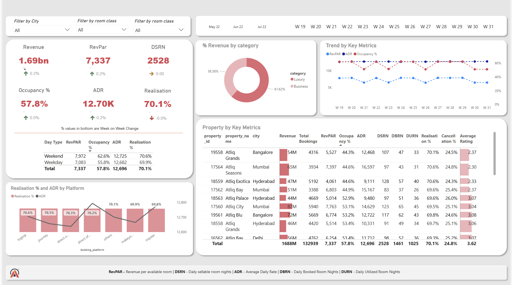

# Hospitality Revenue Insights Dashboard

## Project Overview
This project features an interactive business intelligence dashboard designed to analyze and optimize revenue performance for a luxury hotel chain (**Atliq Grands**). The dashboard tracks key metrics across multiple cities, room classes, and booking platforms to uncover trends, analyze booking behaviors, and provide data-driven recommendations for pricing and inventory management.

## Live Dashboard & Visuals
 

---

## Key Metrics Tracked (KPIs)
* **Revenue:** 1.69bn (with a stable 0.2% Week-on-Week growth).
* **RevPAR (Revenue Per Available Room):** 7,337 — used to measure net revenue generation capabilities against total inventory.
* **Occupancy %:** 57.8% average capacity utilization.
* **ADR (Average Daily Rate):** 12.70K — measuring the average rental income per paid occupied room.
* **Realisation %:** 70.1% — tracking the percentage of successfully utilized/paid bookings out of total initiated bookings.
* **DSRN (Daily Sellable Room Nights):** 2,528 rooms available daily.

---

## Core Insights & Findings
* **Category Performance:** Luxury segments drive the vast majority of organizational revenue (**61.62%**) compared to the Business segment (**38.38%**).
* **Temporal Trends:** Weekends consistently outperform weekdays across major metrics, seeing an uptick in both Occupancy (62.6% vs 55.8%) and Average Daily Rate (12,725 vs 12,682).
* **Platform Analysis:** Booking platforms like `logtrip` and `journey` maintain the highest realization percentages (~70.6%), while specific channels exhibit slight variations in ADR margins.
* **Property Diagnostics:** Properties in Mumbai and Bangalore (e.g., Atliq Seasons, Atliq Cities) are driving the highest raw revenue volume, though average ratings across multiple properties hover around 2.3 - 3.6, indicating room for service delivery improvement.

---

## Technical Stack & Tools Used
* **BI Platform:** Power BI 
* **Data Modeling:** Star Schema / DAX calculated measures (for RevPAR, ADR, Realisation metrics).
* **Data Transformation:** Power Query for cleaning missing values, structuring date tables, and normalization.

## How to Interact with the Project
1. Download the main dashboard file from this repository.
2. Open the file using Power BI Desktop.
3. Use the top filters (City, Room Class) to dynamically slice the visualizations.
